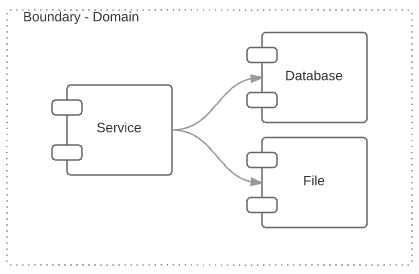
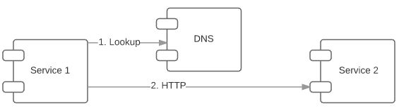
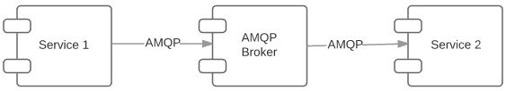

#Microservices - the boundary

This post series are a few notes on Microservices, based on observations on some experience and research.

##TL;DR;

general guidance is that each Microservice follows

- Single Responcibility Pincipal.
- Look for domain boundaries to identify a Microservice.
- Any resource is encapsulated, ie no other service can access my database.
- Consider an EDA architecture, with eventual consistancy.
- Make services stateless.

# Microserice

<figure>
	<a href="../images/posts/2015/microservices/service-boundary.JPG"></img></a>
	<figcaption><a href="../images/posts/2015/microservices/service-boundary.JPG" title="Microserive">Microservice</a>.</figcaption>
</figure>

Considering the definition for a Service Oriented Architecure, a Microserice another iteration on this idea where each service is meant to have a single purpose. The goal is to cut up an application into smaller bounded contexts, and host these in thier own service. In the past people would implement a single service teir for the entire application, this would not be seperated into several.

Each Microservice can have

- its own API (which could be HTTP, AMQP etc).
- its own resources (databases, files etc), which cannot be accessed by anyone else.

##API

there are a number of ways to expose an API with services. The 2 main ways I have seen is HTTP and AMQP. But more importantly we need to consider the style of of interaction we have:

- Request Response **(R/R)**, mainly sync - a client will send a request and the service will provide a response.
- Publish Subscribe **(P/S)**, async, normally indirect - a client will publish information, called an Event, and the service will subscribe and act accordingly.

you can achive both sytles with both HTTP and AMQP.

###HTTP

<figure>
	<a href="./../images/posts/2015/microservices/service-http.JPG"></img></a>
	<figcaption><a href="./../images/posts/2015/microservices/service-http.JPG" title="Microserive">Access services via HTTP</a>.</figcaption>
</figure>

With the HTTP, you can supply both R/R and P/S. the key with this interface is to imbrace the HTTP Verbs so chose a framework which supports these easliy (Express/NancyFx/Sinatra).

To achive R/R is pretty much out of the box, note to achive async feedback you can return the HTTP status 203.

To achive P/S, this could be done via WebHooks. where the subscribers will regierster an endpoint with the service, which can be called when an event occours.

The challange with this style has been service discovery and loadbalancing (I will have a post on that later), the good news this is becoming easier by the day, with tools such as Rancher, Kuberneties, etc.

###AMQP

<figure>
	<a href="./../images/posts/2015/microservices/service-amqp.JPG"></img></a>
	<figcaption><a href="./../images/posts/2015/microservices/service-amqp.JPG" title="Microserive">Access services Via AMQP</a>.</figcaption>
</figure>

Using an AMQP broker we can achive both R/R and P/S, with components such as RabbitMq this is provided out of the Box.

to achive R/R, this is achived by the client providing a return queue (each client instance will have their own return queue) and sending a requst with a corralation ID and location of the return queue. the service will send the response back to the return queue with the correct corralation ID. this seems a little complex but there are a couple of frameworks which do this all for you, such as EasyNetQ. 

to achive P/S, this is out of the box for all the frameworks which support AMQP.

This provide a couple of interesting side effects.

- indirection
- service location
- a bit of a challange with regards to R/R. consider if more than one service responds.

##Resources

<figure>
	<a href="./../images/posts/2015/microservices/service-boundary-donot access-others.JPG"></img></a>
	<figcaption><a href="./../images/posts/2015/microservices/service-boundary-donot access-others.JPG" title="Encapsulte resources">Microservice</a>.</figcaption>
</figure>

As part of following good engineering parctices we aim to Encapsulate our internals from others. This is true for Microservices as well. This means that other services cannot access the database or internal resouces of the current service.

##Scaling

In order to scale a service you would need to ensure that you make it stateless, this does not mean that it cannot have a datastore, it only means that each requst does not need session affintiy to a service instance.
